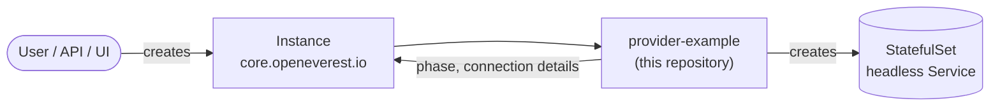

# provider-example

> [!WARNING]
> **Pre-alpha.** OpenEverest v2 is under active development. CRD schemas, chart values and
> defaults change frequently, including in breaking ways.

[](https://github.com/openeverest/provider-example/actions/workflows/ci.yaml)
[](LICENSE)

The smallest complete [OpenEverest](https://github.com/openeverest/openeverest) provider —
written to be read.

## What this is

Every other provider in the OpenEverest organization translates an `Instance` into the custom
resources of a database operator. To follow one, you have to learn that operator's API first,
which is a lot of ceremony in the way of the ten decisions that are actually about OpenEverest.

This provider skips the operator. It manages a **memcached** deployment directly — a
StatefulSet and a headless Service, and nothing else — so that the provider contract is the
only thing left on screen.



memcached earns its place here: it is a real server you can talk to, it starts in under a
second, its command-line flags map cleanly onto component parameters, and its nodes are
independent — clients shard keys across them — so scaling out is honest without any
replication machinery.

> [!IMPORTANT]
> **Not a product.** This provider is a teaching artifact. No image and no chart are
> published, and memcached has no authentication or persistence. Do not run it in production.

## What it demonstrates

| Concept | Where to look |
|---|---|
| Provider identity, components and component types | [definition/provider.yaml](definition/provider.yaml) |
| Version catalog and version bundles | [definition/versions.yaml](definition/versions.yaml) |
| Component parameters | [definition/components/types.go](definition/components/types.go) |
| Topology structure and the UI form schema | [definition/topologies/pool/topology.yaml](definition/topologies/pool/topology.yaml) |
| Rejecting bad specs at admission time | [internal/provider/validate.go](internal/provider/validate.go) |
| Turning a spec into Kubernetes objects | [internal/provider/sync.go](internal/provider/sync.go) |
| Mapping workload state onto Instance phases | [internal/provider/status.go](internal/provider/status.go) |
| Why `Cleanup` is empty | [internal/provider/provider.go](internal/provider/provider.go) |
| RBAC markers → generated `ClusterRole` | [internal/provider/rbac.go](internal/provider/rbac.go) |
| An end-to-end lifecycle test | [test/integration/core/](test/integration/core/) |

It leaves out backups, persistent storage and credentials, so that what remains is only the
provider contract.

## Run it

```bash
make dev-up                              # k3d cluster + OpenEverest core + this provider, via Tilt
kubectl apply -f examples/instance-simple.yaml
kubectl get instance cache -w
```

The Instance walks `Provisioning` → `Initializing` → `Ready`. Once it is ready:

```bash
kubectl get secret cache-conn -o jsonpath='{.data.uri}' | base64 -d
kubectl run probe --rm -i --restart=Never --image=busybox --quiet -- \
  sh -c 'printf "stats settings\r\n" | nc cache 11211 | grep -E "maxbytes|maxconns|num_threads"'
```

The `maxconns` and `num_threads` in that output are the component parameters from the Instance,
and `maxbytes` is derived from its memory limit. Then try the pool:

```bash
kubectl apply -f examples/instance-example.yaml
```

[dev/README.md](dev/README.md) covers running against an existing cluster and every
`dev/.env` setting.

## Learn it

The [tutorial](https://github.com/openeverest/provider-sdk/blob/main/TUTORIAL.md) builds this
repository from an empty scaffold, one concept at a time. Read it alongside the code.

The provider contract itself — `Validate` / `Sync` / `Status` / `Cleanup`, watches, RBAC, code
generation, backup interfaces — is documented once for all providers in
[PROVIDER_DEVELOPMENT.md](https://github.com/openeverest/provider-sdk/blob/main/PROVIDER_DEVELOPMENT.md).

## Topologies

| Topology | Nodes | Description |
|---|---|---|
| `pool` | 1–9 | Independent nodes that clients shard keys across. |

One topology, because memcached has one architecture — running more nodes is a replica count,
not a different way of assembling the system.

## Versions

| Version bundle | Default | Engine image |
|---|---|---|
| `1.6.38` | ✅ | `memcached:1.6.38-alpine` |
| `1.6.31` | | `memcached:1.6.31-alpine` |

Source of truth: [definition/versions.yaml](definition/versions.yaml).

## Development

```bash
make generate           # RBAC, provider spec, Helm chart sync
make test-unit
make test-integration   # chainsaw suites; needs a cluster with the provider deployed
make verify             # fails when generated files are stale
```

`make help` lists every target.

### Layout

| Path | Purpose |
|---|---|
| `definition/` | Provider identity, components, versions, topologies, UI schema |
| `internal/provider/` | `ProviderInterface` implementation and RBAC markers |
| `internal/common/` | Names shared between the definition and the code |
| `cmd/provider/` | Entry point |
| `charts/provider-example/` | Helm chart (`generated/` is produced by `make generate`) |
| `config/rbac/role.yaml` | Generated `ClusterRole` — do not edit |
| `test/integration/` | Chainsaw suites |
| `examples/` | Example `Instance` resources |
| `dev/` | Tilt dev environment, k3d cluster config |

## Troubleshooting

```bash
kubectl logs -n provider-system deploy/provider-example -f
```

| Symptom | Where to look |
|---|---|
| `Instance` ignored entirely | `spec.providerRef.name` must be `example` |
| No `Provider` resource in the cluster | Is the chart installed? Check the provider deployment logs |
| `Instance` stuck in `Provisioning` | `kubectl describe instance <name>`, then the provider logs |
| `Instance` stuck in `Initializing` | `kubectl describe pod cache-0` — usually image pull or scheduling |

## Contributing

Issues and pull requests are welcome. See the
[OpenEverest Code of Conduct](https://github.com/openeverest/openeverest/blob/main/CODE_OF_CONDUCT.md).
All commits must carry a `Signed-off-by` trailer (`git commit -s`).

## Security

Report vulnerabilities per the
[OpenEverest security policy](https://github.com/openeverest/openeverest/blob/main/SECURITY.md).
Please do not open public issues for security reports.

## License

Apache License 2.0 — see [LICENSE](LICENSE).
